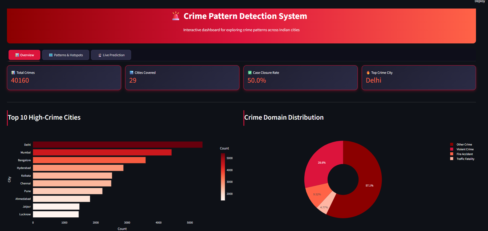
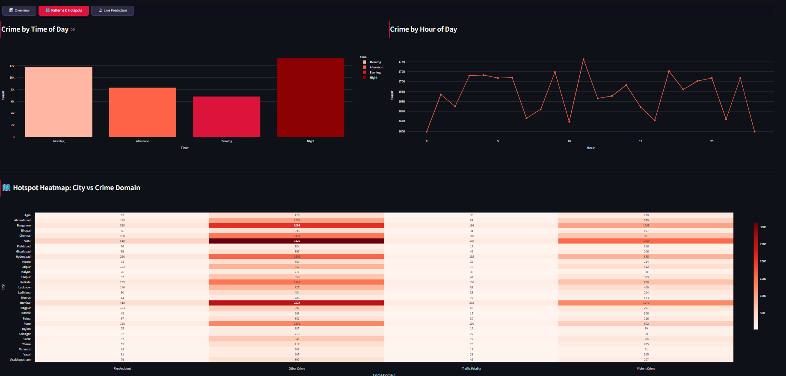
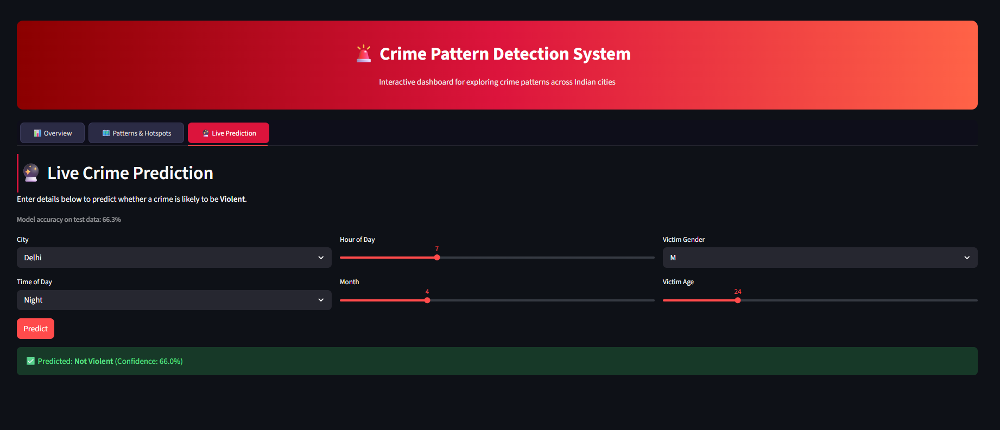

# 🚨 Crime Pattern Detection System

A data-driven system to analyze crime records across Indian cities, uncover patterns, identify high-crime hotspots, and predict crime severity using Machine Learning — packaged in an interactive live dashboard.


---

## 📌 Overview

This project analyzes the **Crime Dataset India** (Kaggle) — over **40,000 crime records** across **29 cities** — to detect meaningful patterns in when, where, and how crimes occur. It combines data cleaning, exploratory analysis, geographic hotspot detection, and a machine learning prediction model, all wrapped inside an interactive Streamlit dashboard.

The goal is to answer questions like:
- Which crime types are most common?
- Which cities/areas have the highest crime rates?
- What time of day/month/year do crimes spike?
- Can we flag high-risk areas and predict crime severity?

---

## 🖼️ Dashboard Preview

### Overview Tab — KPIs, Top Cities, Crime Domain Split


### Patterns & Hotspots Tab — Time Trends + Heatmap


### Live Prediction Tab — Predict Violent vs Non-Violent Crime


> 📁 To add your own screenshots: create a `screenshots` folder in this repo and upload images named `overview.png`, `hotspots.png`, and `prediction.png` (or update the paths above to match your file names).

---

## ✨ Features

- 🧹 **Data Cleaning** — handles mixed date formats, missing values, and feature engineering
- 📊 **Exploratory Analysis** — crime type frequency, city-wise distribution, time trends
- 🗺️ **Hotspot Detection** — city vs crime-domain heatmap to flag high-risk areas
- ⏱️ **Time Pattern Analysis** — crime frequency by hour of day, time-of-day buckets (Morning/Afternoon/Evening/Night)
- 🤖 **ML Prediction Model** — Random Forest Classifier predicts whether a crime is likely "Violent"
- 🖥️ **Interactive Dashboard** — tabbed layout (Overview / Patterns & Hotspots / Live Prediction) with filters and a live prediction form

---

## 🗂️ Project Structure

```
Crime-Pattern-Detection-System/
├── crime_dataset_india.csv       # Raw dataset (Kaggle)
├── 01_data_cleaning.py           # Cleans and preprocesses raw data
├── 02_eda_analysis.py            # Exploratory data analysis
├── 03_visualizations.py          # Generates static chart images
├── 04_hotspot_detection.py       # City-wise crime hotspot heatmap
├── 05_prediction_model.py        # Trains and evaluates ML model
├── 06_dashboard.py               # Interactive Streamlit dashboard
├── charts/                       # Saved static chart images (PNG)
├── screenshots/                  # Dashboard preview screenshots (for README)
└── README.md
```

---

## 🚀 How to Run

### 1. Clone or download this repository
```bash
git clone https://github.com/Harshitabisht2828/Crime-Pattern-Detection-System.git
cd Crime-Pattern-Detection-System
```

### 2. Install dependencies
```bash
pip install pandas matplotlib seaborn scikit-learn streamlit plotly
```

### 3. Run the pipeline (in order)
```bash
python 01_data_cleaning.py
python 02_eda_analysis.py
python 03_visualizations.py
python 04_hotspot_detection.py
python 05_prediction_model.py
```

### 4. Launch the interactive dashboard
```bash
streamlit run 06_dashboard.py
```

The dashboard will open automatically in your browser at `localhost:8501`.

---

## 📈 Key Insights

| Insight | Finding |
|---|---|
| 🏙️ Top High-Crime Cities | Delhi, Mumbai, Bangalore |
| 🌙 Peak Crime Time | Night, followed by Morning |
| ⚖️ Crime Domain Split | Majority fall under "Other Crime", followed by Violent Crime |
| ✅ Case Closure Rate | ~50% of cases get closed |
| 🎯 Model Accuracy | ~65% on predicting violent vs non-violent crimes |

> **Note:** Several fields in this dataset (crime-type counts, day-of-week, case closure) are near-uniformly distributed, suggesting parts of the dataset are synthetically generated. City and time-of-day patterns show the clearest real signal, and were prioritized in this analysis.

---

## 🤖 About the Prediction Model

The dashboard includes a live prediction tool powered by a **Random Forest Classifier**:

- **Input features:** City, Time of Day, Hour, Month, Victim Gender, Victim Age
- **Target:** Whether the crime is likely to be classified as "Violent Crime"
- **Process:** Categorical features are label-encoded, data is split 80/20 into train/test sets, and the model is evaluated on unseen test data
- **Output:** A prediction (Violent / Not Violent) along with a confidence percentage

---

## 🛠️ Tech Stack

- **Python 3** — core language
- **pandas** — data manipulation
- **matplotlib / seaborn** — static visualizations
- **plotly** — interactive charts
- **scikit-learn** — machine learning (Random Forest)
- **Streamlit** — interactive web dashboard

---

## 🔮 Future Improvements

- [ ] Use a real (non-synthetic) crime dataset for more reliable patterns
- [ ] Add latitude/longitude based geographic mapping
- [ ] Improve prediction accuracy with advanced models (XGBoost)
- [ ] Deploy the dashboard online (Streamlit Community Cloud) for public access
- [ ] Add year-over-year trend forecasting

---

## 📄 License

This project is open-source and available under the [MIT License](LICENSE).

---

## 🙋‍♀️ Author

**Harshita Bisht**
Project built as part of learning data analysis, visualization, and machine learning with Python.

⭐ If you found this project useful, consider giving it a star on GitHub!
